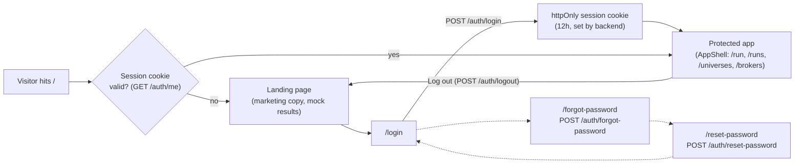

# 📈 Stock Screener — Frontend

The web UI for the **Modular Stock Screener** backend (a separate FastAPI repo) — submit
screens against NSE/BSE universes, watch them run in the background, and review/export
results.
Built with [Lovable](https://lovable.dev); this is a **separate repository** from the FastAPI
backend by design (see the backend's `REQUIREMENTS.md` "Notable decisions" section for why),
talking to it purely over REST.

> This repo has no backend of its own — every screen, universe, broker-status, and login call
> goes to a FastAPI service you run/deploy separately. See [Connecting to the backend](#-connecting-to-the-backend)
> below before expecting anything to load.

## 🔐 Instance login

The backend gates the whole app behind a single instance-wide login (one account for the
whole deployment, not per-user — see the backend's `SessionStatus` docstring). Unauthenticated
visitors land on a marketing page at `/`, not a blind redirect:



`AppShell` (used by every protected route) re-checks the session on window refocus, so an
expired or externally-invalidated session bounces you back to `/login` without needing a
manual reload. `/forgot-password` takes no input — there's only one account, so the button
just requests a reset link to whatever recovery address the backend has configured.

## Pages

| Route | Purpose |
|---|---|
| `/` | Public marketing/landing page for unauthenticated visitors; redirects straight to `/run` if already logged in. |
| `/login`, `/forgot-password`, `/reset-password` | Instance login and password recovery (see above). |
| `/run` | Submit a screen — pick a saved universe or paste tickers, a mode (fetched live from the backend), a broker, and (for Custom mode) an indicator/condition builder. |
| `/runs/:runId` | Poll a run's status (`queued → running → completed/failed`), view results once done, download the Excel export. |
| `/runs` | "Past Runs" — every run recorded by the backend, most-recent-first. Select one or more rows to delete (see below). |
| `/universes` | Upload a CSV or paste a ticker list; browse saved universes. |
| `/brokers` | Live broker auth status (Breeze/Angel/Yahoo), manual re-auth trigger, and a credentials dialog for Breeze/Angel (see below). |
| `/help` | In-app walkthrough of running screens, building Custom-mode conditions, and reading results. |
| `/settings` | Override the backend URL / API key at runtime, and toggle dark/light appearance — all stored in this browser's `localStorage` without a rebuild. |

All of the above except `/`, `/login`, `/forgot-password`, and `/reset-password` are wrapped
in `AppShell` and require a valid session.

## 🎛️ Screening modes

Fetched live from `GET /screens/modes` (nothing about available modes is hardcoded):

- **Outperforming** — RSI beats a NIFTY 50 benchmark, ATR% clears a volatility floor, and
  Comparative Relative Strength is above its own moving average. All three must hold.
- **Chandemo** — a two-timeframe Chande Momentum Oscillator confluence check (monthly WATCH,
  weekly BUY requiring WATCH, weekly EXIT).
- **Custom** — pick any registered indicator(s), a timeframe, and an arbitrary AND/OR-nestable
  condition tree, built with the in-app `ConditionBuilder`. Any indicator flagged
  `needs_benchmark` by the backend (currently `Comparative_RS`) shows an inline benchmark-ticker
  field (defaults to `NIFTY`); it's added and removed automatically as you swap indicators, since
  the backend rejects both a missing required benchmark and a stray one on an indicator that
  doesn't use it.

Custom mode's indicator list, default parameters, and available condition fields all come from
`GET /screens/indicators` — a new indicator added to the backend shows up here with no
frontend change.

## 🔑 Broker credentials

`/brokers` has a **Credentials** button for Breeze and Angel (Yahoo needs none — its adapter
never reads the credential store, so showing a form for it would be misleading):

- **Breeze** — a session token pasted in daily (ICICI's session expires at midnight or 24h,
  whichever is first), plus API key/secret tucked behind an "Also update" toggle.
- **Angel** — client ID, trading PIN, and TOTP secret (the base32 seed, not a live 6-digit
  code) for headless auth with no daily re-login, plus API key behind the same toggle.

Saving calls `PUT /brokers/{name}/credentials` and immediately re-authenticates, so the
response tells you whether it actually worked, not just "saved" — a bad paste still gets
stored (never rolled back) but surfaces the real error (e.g. Breeze's login URL). Already-set
fields show a green **Set** badge instead of the raw value; an eye/reveal button next to each
one calls `GET /brokers/{name}/credentials/{key_name}/reveal` **on click only** to show a
masked partial hint (dots plus up to the last 4 characters) — enough to confirm you saved the
right thing without ever displaying the real value.

## 🗑️ Deleting runs

`/runs` supports per-row and multi-select delete (checkboxes + a "Delete selected" bar). There's
no bulk-delete endpoint on the backend, so a multi-delete fires one `DELETE /screens/:runId`
per selected id via `Promise.allSettled`, so one failure doesn't block the rest. The
confirmation dialog is explicit that this only removes the run's metadata and per-ticker
results — fetched OHLCV/instrument data stays cached and is never touched.

## ⚡ Quick Start

**Prerequisites**: [Bun](https://bun.sh) (this repo is `bun.lock`-based, not npm/yarn), the
backend running somewhere reachable (see its own README for `docker compose up -d --build` or
the local `venv` path).

```sh
bun install
bun run dev
```

Opens on `http://localhost:8080` by default (or whatever port Vite prints). With no
`VITE_API_BASE_URL` set, it defaults to `http://127.0.0.1:8000` — override via `.env` (see
below) or the `/settings` page at runtime.

## 🔧 Connecting to the backend

Two ways to point this at a backend, in order of precedence:

1. **`/settings` page** (runtime, no rebuild) — sets `localStorage` overrides for backend URL
   and API key. Useful for pointing the same deployed frontend at a different backend without
   redeploying.
2. **Build-time env vars** (`.env`, or Lovable Secrets when deployed there):
   - `VITE_API_BASE_URL` — the backend's base URL (e.g. `http://127.0.0.1:8000` locally, or
     wherever it's deployed). Defaults to `http://127.0.0.1:8000` if unset.
   - `VITE_API_KEY` — only needed if the backend has `API_KEY` set. Sent as `X-API-Key` on
     every request unconditionally; harmless if the backend doesn't check it.

Vite env vars are compile-time, not runtime — when building the [Docker image](#-docker), these
must point at a URL every browser loading the app can actually reach (the server's LAN IP,
never `localhost`), and changing them means rebuilding the image.

Every request is also sent with `credentials: "include"` so the instance-login session cookie
attaches — this only works if frontend and backend share (or are configured to share) cookies
across origins.

**The backend must allow this frontend's origin via CORS** — set `CORS_ALLOWED_ORIGINS` in
the backend's `.env` to match wherever this app is actually served from (e.g.
`http://localhost:8080` for local dev), or every request will fail in the browser with a CORS
error despite the backend itself being reachable (`curl` from a terminal will look fine —
CORS is a browser-enforced check, not a server-side one).

## 🧠 What the backend actually does

Screens run as **background jobs**, not a blocking request: `POST /screens/run` returns
almost instantly with `status: "queued"`, and this app polls `GET /screens/:runId` until it's
`completed` or `failed`. There's no synchronous "wait for the result" call — every screen
submission immediately navigates to the run's detail page, which owns the polling.

## 🐳 Docker

```sh
docker build \
  --build-arg VITE_API_BASE_URL=http://<your-backend-host>:8000 \
  --build-arg VITE_API_KEY=<optional> \
  -t stock-screener-frontend .

docker run -p 3000:3000 stock-screener-frontend
```

Two-stage build: `oven/bun:1` installs deps and runs `bun run build` (Nitro's `node-server`
preset, set in `vite.config.ts`, emits a standalone Node app at `.output/`), then a plain
`node:22-alpine` runtime stage runs `.output/server/index.mjs` with no bun/dev deps carried
over. Listens on `0.0.0.0:3000` inside the container. The `VITE_*` build args are baked into
the client bundle — see the note in [Connecting to the backend](#-connecting-to-the-backend).

## 🛠️ Tech stack

- **TanStack Start** (React 19 + Vite, file-based routing with SSR) — routes under `src/routes/`
- **TanStack Query** for all data fetching/polling, **TanStack Table** for the results grid
- **Tailwind CSS 4** + **shadcn/ui** (Radix primitives) components
- **react-hook-form** + **zod** for the run-config and login/reset-password forms
- **Bun** as the package manager/runtime; **Nitro** (`node-server` preset) for the production
  server build
- API client: `src/lib/api.ts` (typed wrapper over the backend's REST endpoints) +
  `src/lib/config.ts` (backend URL/key resolution — env var → `localStorage` override) +
  `src/lib/auth.tsx` (session state via `useAuth()`, backed by `GET /auth/me`)

## Building / deploying

```sh
bun run build    # production build (Nitro node-server target locally/Docker, Cloudflare in Lovable)
bun run preview  # preview the production build locally
```

Deployed and synced via Lovable's GitHub two-way sync — changes made in the Lovable editor
commit here automatically, and pushes to this repo sync back into Lovable. Outside a Lovable
build, `vite.config.ts` overrides Nitro's default Cloudflare preset with `node-server` so a
local or Docker build emits a plain Node server instead (see [Docker](#-docker) above).

## Credits

UI/UX design guidance used while building this app's styling and layout (typography scale,
table hierarchy, color/consistency reviews) came from the
[`ui-ux-pro-max`](https://github.com/nextlevelbuilder/ui-ux-pro-max-skill) Claude Code skill
by [nextlevelbuilder](https://github.com/nextlevelbuilder), vendored under `.claude/ui-ux-pro-max/`.
